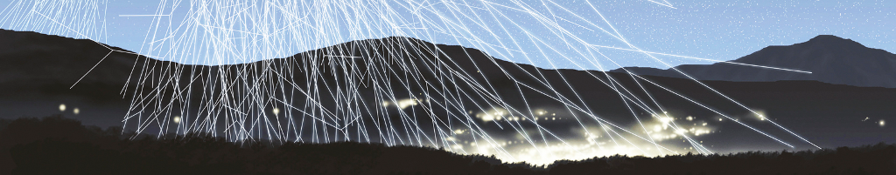

# ## Física de Astropartículas - Primer semestre de 2018

**Asignatura destinada a estudiantes de Maestría o Doctorado en Física o Astrofísica del programa del Doble Doctorado en Astrofísica (DDAp), [ITeDA](http://www.iteda.cnea.gov.ar/)-[UNSAM](http://www.unsam.edu.ar/) y [KIT](https://www.kit.edu/)**

## Información importante

Este commit correponde a la última edición del curso, correspondiente a la Cohorte 2017. Con este commit y release se da por cerrado el repositorio.

Todo este material ha sido liberado utilizando una licencia de dominio público creative commons [CC0-1.0-Universal](https://creativecommons.org/publicdomain/zero/1.0/). Por favor revise los [términos de la licencia](#licencia) antes de su uso.

Las clases fueron realizados en [LibreOffice Impress](https://es.libreoffice.org/descubre/impress/), la herramienta de presentaciones de [LibreOffice](https://es.libreoffice.org/). Para poder visualizar correctamente las clases, por favor descarguelo siguiendo el este enlace: **[Descargue LibreOffice](https://es.libreoffice.org/descarga/libreoffice-estable/)**. En Windows, puede ser necesario descargar también la fuente [Cabin](https://www.fontsquirrel.com/fonts/download/cabin). Para facilitar la difusión, se incluyen también versiones de las clases en formato pdf. Para visualizarlo, podría necesitar descargar [Acrobat Reader](https://get.adobe.com/es/reader).

## Programa

### [Unidad 1: Fenomenología de Astropartículas](clases/)
Introducción a astrofísica relativista. Mecanismos de producción. Posibles fuentes de astropartículas. Propagación de rayos cósmicos en el medio intergaláctico e interestelar y sus consecuencias observacionales. Transporte heliosférico y magnetosférico. *Laboratorio virtual unidad 1*: Propagación en el medio intergaláctico con [CrPropa v3](https://github.com/CRPropa/CRPropa3/wiki/)

### [Unidad 2: Lluvias Atmosféricas Extendidas (EAS)](clases/)
Introducción a interacción de la radiación con la materia. La atmósfera de la Tierra y Marte. Modelos de desarrollo de una EAS. Principales características de las EAS iniciadas por fotones,protones y núcleos pesados. Universalidad. Partículas secundarias y su distribución longitudinal y transversal. Principales observables de las EAS. *Laboratorio virtual unidad 2*: Simulación de una EAS en [CORSIKA](http://www-ik.fzk.de/corsika/).

### [Unidad 3: Técnicas de detección de Astropartículas](clases/)
Introducción a técnicas de detección de partículas. Técnicas de detección directa: globos y satélites. Principales observatorios de detección directa. Técnicas de detección indirecta: muestreo longitudinal, lateral y técnica de partícula solitaria. Principales detectores de astropartículas: telescopios de fluorescencia; telescopios Cherenkov; detectores Cherenkov en agua; detección por radio; centelladores; cámaras de placas resistivas; otros detectores. Técnicas de reconstrucción. *Laboratorio virtual unidad 3*: Simulación básica de un detector.

### [Unidad 4 Aplicaciones y análisis de datos](clases/)
Introducción al análisis de datos. Astronomía gamma y destellos de rayos gamma. Astronomía de partículas cargadas. Meteorología y clima del Espacio; Radiación en el entorno cercano a la Tierra. Ionización atmosférica; Muongrafía. *Laboratorio Virtual Unidad 4*: Análisis de datos de meteorología del espacio y del decaimiento del muón en un detector Cherenkov en agua.

## Materiales y herramientas

### Máquina virtual LAGUBUNTU

En el marco del proyecto [LAGO](http://lagoproject.org/) se ha creado una máquina virtual, basada en [lubuntu](http://lubuntu.net/), una implementación liviana de [ubuntu](https://www.ubuntu.com/), y con todos los códigos necesarios para ejecutar los ejercicios planteados, que está disponible para su descarga en [lagubuntu.ova en google drive](https://drive.google.com/file/d/0B0dvJZDeK85fM0JYbDhBeFlkems/view?usp=sharing).

Esta máquina virtual emplea tecnologías de virtualización de [virtualbox](https://www.virtualbox.org/), versión 5.1 o superior, que es necesario [descargar e instalar](https://www.virtualbox.org/wiki/Downloads) para la ejecución de la máquina virtual. En caso de usarla, solicitar por correo el usuario y la contraseña.

### Licencia

(C) 2017, 2018 - Hernán Asorey

<a property="dct:title" rel="cc:attributionURL" href="https://github.com/asoreyh/fisica-de-astroparticulas">Física de Astropartículas (DDAp, UNSAM/KIT)</a> by <a rel="cc:attributionURL dct:creator" property="cc:attributionName" href="https://github.com/asoreyh/">Hernán Asorey</a> is marked with <a href="https://creativecommons.org/publicdomain/zero/1.0/?ref=chooser-v1" target="_blank" rel="license noopener noreferrer" style="display:inline-block;">CC0 1.0 Universal</a>.
